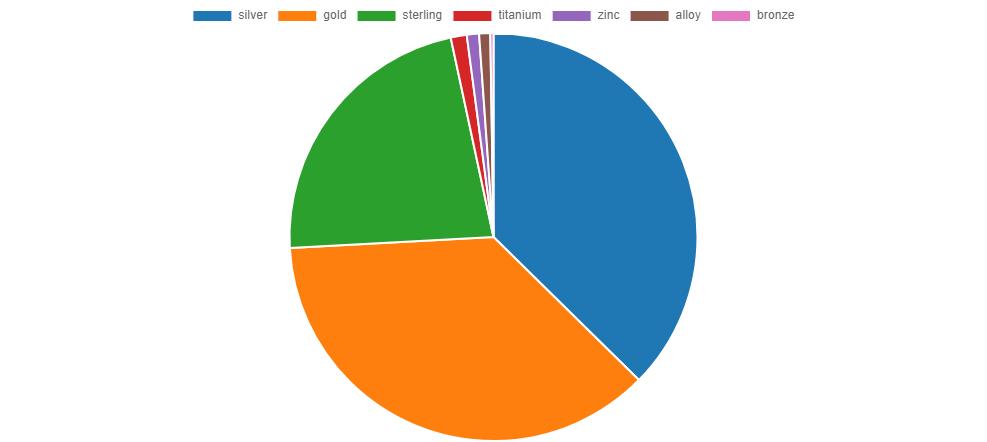

# JEWELRY_AMAZON Data Analytics Project

## Overview

This data analytics project encompasses the entire ETL process, incorporating Python, Excel, SQL, and Tableau. The key steps involved in the project include:

1. **Extraction:** Utilizing Python libraries, such as BeautifulSoup, to extract product data from Amazon.

2. **Transformation and Cleaning:** Employing SQL and Excel for data cleaning and transformation processes.

3. **Consolidation and Loading:** Loading the cleaned data into Tableau for comprehensive analysis and visualization.

## 1) Extract: Amazon Scraper Script


The `amazon_scraper.py` script serves the purpose of scraping vital product information from Amazon. The extracted variables include:

- **Product Title**
- **Rating**
- **Reviews**
- **Price**
- **Brand/Store**
- **Availability**
```python
# from concurrent.futures import ThreadPoolExecutor
from bs4 import BeautifulSoup
import requests
import pandas as pd

def get_title(new_soup):
    try:
        title = new_soup.find("span", attrs={"id": 'productTitle'})
        title_value = title.text
        title_string = title_value.strip()
    except AttributeError:
        title_string = None
    return title_string

def get_price(new_soup):
    try:
        price_element = new_soup.find("span", attrs={'class': 'a-price-whole'})
        price = price_element.text.strip()
    except AttributeError:
        price = None
    return price

def get_rating(new_soup):
    try:
        rating = new_soup.find("span", attrs={'class': 'a-size-base a-color-base'})
        rating_value = rating.text.strip()
    except AttributeError:
        rating_value = None
    return rating_value

def get_no_rating(new_soup):
    try:
        no_rating = new_soup.find("span", attrs={'id': 'acrCustomerReviewText'})
        no_rating_value = no_rating.text.strip()
    except AttributeError:
        no_rating_value = None
    return no_rating_value

def get_available(new_soup):
    try:
        available = new_soup.find("span", attrs={'class': 'a-size-medium a-color-success'})
        available_value = available.text.strip()
    except AttributeError:
        available_value = None
    return available_value

def get_brand(new_soup):
    try:
        brand = new_soup.find("a", attrs={'id': 'bylineInfo'})
        brand_value = brand.text.strip()
    except AttributeError:
        brand_value = None
    return brand_value

def scrape_product_data(link):
    try:
        HEADERS = {
            'User-Agent': 'Mozilla/5.0 (Windows NT 10.0; Win64; x64) AppleWebKit/537.36 (KHTML, like Gecko) Chrome/120.0.0.0 Safari/537.36',
            'Accept-Language': 'en-US, en;q=0.5'
        }

        new_webpage = requests.get("https://www.amazon.sa" + link, headers=HEADERS)
        new_soup = BeautifulSoup(new_webpage.content, "html.parser")

        title = get_title(new_soup)
        price = get_price(new_soup)
        rating = get_rating(new_soup)
        no_rating = get_no_rating(new_soup)
        available = get_available(new_soup)
        brand = get_brand(new_soup)

        return {"title": title, "price": price, "rating": rating, "reviews": no_rating, "availability": available, "brand": brand}

    except Exception as e:
        print(f"Error processing link {link}: {e}")
        return None

if __name__ == '__main__':
    # List of URLs to scrape
    urls = [
        'https://www.amazon.ae/s?i=fashion&rh=n%3A11995892031&fs=true&page=63',
        'https://www.amazon.ae/s?i=fashion&rh=n%3A11995892031&fs=true&page=64',
        # Add other URLs here
    ]

    links_list = []

    with ThreadPoolExecutor(max_workers=5) as executor:
        # Extract links from all URLs
        for url in urls:
            webpage = requests.get(url, headers={'User-Agent': 'Mozilla/5.0'})
            soup = BeautifulSoup(webpage.content, 'html.parser')
            links = soup.find_all('a', attrs={'class': 'a-link-normal s-underline-text s-underline-link-text s-link-style a-text-normal'})
            links_list.extend([link.get('href') for link in links])

        # ThreadPoolExecutor to scrape data concurrently
        scraped_data = list(executor.map(scrape_product_data, links_list))

    # Remove None values from the list
    scraped_data = [data for data in scraped_data if data is not None]

    # Create DataFrame from the scraped data
    amazon_df = pd.DataFrame(scraped_data)

    # Drop rows with missing titles
    amazon_df.dropna(subset=['title'], inplace=True)

    # Save DataFrame to CSV
    amazon_df.to_csv("amazon_data.csv", sep=';', header=True, index=False, encoding='utf-8')
```
## 2) Transform: PostgreSQL Script for Data Cleaning and Analysis

### Overview

In this phase, PostgreSQL scripts were utilized for data cleaning and analysis, focusing on three primary files: `products`, `products_ae`, and `fixtures`. The `products` and `products_ae` files contain product data, while `fixtures` comprise Amazon UAE reviews.

**Uploaded Files:**
1. `products`: Amazon KSA product data file.
2. `products_ae`: Amazon UAE product data.
3. `fixtures`: Amazon UAE reviews (for `products_ae`).

During the process, a specific SQL script was employed to address the accidental deletion of a column from `products_ae`. The script involves joining tables to combine review columns for comprehensive analysis of `products_ae`.


#### 1) Update & Cleaning:
```sql
-- Remove unwanted words/text
UPDATE products_ae
SET reviews = UPPER(TRIM(REPLACE(reviews, 'S', '')));

-- Segregate title based on category type
ALTER TABLE products_ae
ADD COLUMN categories VARCHAR(255));

UPDATE products_ae
SET categories =
    CASE
        WHEN LOWER(title) LIKE '%bracelet%' THEN 'Bracelets'
        WHEN LOWER(title) LIKE '%necklace%' THEN 'Necklaces'
        WHEN LOWER(title) LIKE '%brooche%' THEN 'Brooches'
        WHEN LOWER(title) LIKE '%earring%' THEN 'Earrings'
        WHEN LOWER(title) LIKE '%bracelet%' THEN 'Bracelet'
        WHEN LOWER(title) LIKE '%charm%' THEN 'Charms'
        WHEN LOWER(title) LIKE '%ring%' THEN 'Rings'
        ELSE 'others'
    END;
```
Merge the two data sets
```sql
-- Create a new table 'products_merged' by merging 'products' and 'products_uae'
CREATE TABLE products_merged AS
SELECT * FROM products
UNION ALL
SELECT * FROM products_uae;
```
#### 2) Exploratory Data Analysis:
Category Analysis:
```sql

-- Show cats with average rating, average product price, cat count, and number of reviews
SELECT
    categories,
    ROUND(AVG(rating), 1) AS average_rating,
    SUM(reviews) AS number_of_reviews,
    ROUND(AVG(price), 0) AS avg_product_price,
    COUNT(categories) AS cat_count
FROM
    products_merged
WHERE
    rating IS NOT NULL
GROUP BY
    categories
ORDER BY
    number_of_reviews DESC;
```
| Categories  | Average Rating | Number of Reviews | Average Product Price | Category Count |
|-------------|-----------------|-------------------|------------------------|----------------|
| Earrings    | 4.2             | 1,356,483         | 118                    | 3,647          |
| Bracelets   | 4.3             | 1,300,685         | 128                    | 3,114          |
| Necklaces   | 4.3             | 1,096,230         | 159                    | 2,867          |
| Others      | 4.2             | 639,381           | 146                    | 1,838          |
| Rings       | 4.2             | 635,337           | 135                    | 1,600          |
| Other       | 4.3             | 253,869           | 171                    | 510            |
| Charms      | 4.7             | 66,461            | 212                    | 113            |
| Brooches    | 4.6             | 50,206            | 95                     | 295            |

```sql
-- Check category distribution between UAE and KSA
SELECT
    categories,
    SUM(CASE WHEN source = 'ae' THEN count ELSE 0 END) AS count_ae,
    SUM(CASE WHEN source = 'sa' THEN count ELSE 0 END) AS count_sa
FROM (
         SELECT categories, COUNT(*) AS count, 'ae' AS source
         FROM products_ae
         GROUP BY categories

         UNION ALL

         SELECT categories, COUNT(*) AS count, 'sa' AS source
         FROM products
         GROUP BY categories
     ) AS subquery
GROUP BY
    categories;
```


Word Analysis:
```sql
-- Create the temporary table
CREATE TEMPORARY TABLE temp_word AS
SELECT
    DISTINCT UNNEST(STRING_TO_ARRAY(LOWER(title), ' ')) AS word,
    rating
FROM products_merged;

-- Show words with average high rating and highest word occurrence
SELECT
    word,
    COUNT(*) AS word_count,
    AVG(rating::numeric) AS average_rating
FROM
    temp_word
WHERE
    LENGTH(word) >= 3
GROUP BY
    word
HAVING
    AVG(rating::numeric) >= 4.5
ORDER BY
    word_count DESC
LIMIT 20;
```


```sql
-- Get the most occurring words
SELECT
    COUNT(*) AS word_count,
    word
FROM (
    SELECT
        UNNEST(STRING_TO_ARRAY(LOWER(title), ' ')) AS word
    FROM
        products_merged
) AS subquery
WHERE
    LENGTH(word) > 3
GROUP BY
    word
HAVING
    COUNT(*) >= 100
ORDER BY
    word_count DESC;

```
| Word Count | Word      |
|------------|-----------|
| 14838      | women     |
| 8526       | earrings  |
| 7432       | with      |
| 7231       | necklace  |
| 6915       | silver    |
| 6804       | gold      |
| 6669       | jewelry   |
| 6340       | bracelet  |
| 4538       | girls     |
| 4454       | from      |
| 4163       | sterling  |
| 3426       | ring      |
| 3186       | beads     |
| 3164       | plated    |
| 3055       | crystal   |
| 2763       | gift      |
| 2471       | bracelets |
| 2407       | stone     |
| 2359       | gifts     |
| 2298       | chain     |

```sql
-- Check material distribution
SELECT
    word,
    COUNT(word) AS word_count
FROM
    temp_words
WHERE
    word IN ('bronze', 'gold', 'silver', 'sterling',' copper', 'titanium','alloy','zinc')
GROUP BY
    word
ORDER BY
    word_count DESC;
```


```sql
-- Check gender segment
SELECT
    word,
    COUNT(word) AS word_count
FROM
    temp_word
WHERE
    word IN ('men', 'women')
GROUP BY
    word
ORDER BY
    word_count DESC;
```


```sql
-- Check category distribution
SELECT
    word,
    COUNT(word) AS word_count
FROM
    temp_words
WHERE
    word IN ('ring', 'bracelet', 'necklace', 'brooch', 'earrings', 'charm')
GROUP BY
    word
ORDER BY
    word_count DESC;
```


Brand Analysis:
```sql
-- Check brand summary
SELECT
    brand,
    ROUND(AVG(rating), 1),
    SUM(reviews),
    COUNT(brand),
    ROUND(AVG(price), 1)
FROM
    products
WHERE
    brand <> 'Generic'
GROUP BY
    brand
ORDER BY
    COUNT DESC;

-- Fetch distinct brands with reviews, listings, average rating, and average price
SELECT
    DISTINCT brand,
    SUM(reviews) AS reviews,
    COUNT(brand) AS listings,
    ROUND(AVG(rating), 1) AS avg_rating,
    ROUND(AVG(price), 1) AS avg_price
FROM
    products
WHERE
    brand <> 'Generic'
GROUP BY
    brand
ORDER BY
    reviews DESC,
    avg_price
LIMIT 10;
```
| Brand                  | Average Rating | Total Reviews | Brand Count | Average Price |
|------------------------|-----------------|---------------|-------------|---------------|
| GENERIC                | 4.4             | 155,796       | 1,126       | $143.1        |
| PANDORA                | 4.5             | 264,843       | 561         | $298.7        |
| ZAVERI PEARLS          | 3.9             | 89,548        | 356         | $48.7         |
| RIBAI                  | 4.2             | 1,950         | 354         | $88.4         |
| SWAROVSKI              | 4.6             | 147,282       | 314         | $548.8        |
| YOUBELLA               | 3.9             | 202,468       | 250         | $41.0         |
| OTHER                  | 3.7             | 2,024         | 229         | $62.6         |
| SHINING DIVA FASHION   | 3.8             | 119,834       | 228         | $59.4         |
| YELLOW CHIMES          | 3.9             | 84,869        | 212         | $34.4         |
| GUESS                  | 4.2             | 12,662        | 203         | $169.3        |
```sql
-- Compare brand presence across the two markets
SELECT
    brand,
    SUM(CASE WHEN source = 'ae' THEN count ELSE 0 END) AS COUNTAE,
    SUM(CASE WHEN source = 'sa' THEN count ELSE 0 END) AS COUNTSA
FROM (
         SELECT
             brand,
             COUNT(*) AS count,
             'ae' AS source
         FROM products_uae
         GROUP BY brand

         UNION ALL

         SELECT
             brand,
             COUNT(*) AS count,
             'sa' AS source
         FROM products
         GROUP BY brand
     ) AS subquery

GROUP BY
    brand

HAVING
    SUM(CASE WHEN source = 'ae' THEN count ELSE 0 END) >= 10
    AND SUM(CASE WHEN source = 'sa' THEN count ELSE 0 END) >= 10

ORDER BY
    COUNTSA DESC;
```
| Brand                  | CountAE | CountSA |
|------------------------|---------|---------|
| GENERIC                | 265     | 861     |
| PANDORA                | 297     | 264     |
| SWAROVSKI              | 115     | 199     |
| YOUBELLA               | 99      | 151     |
| OTHER                  | 113     | 116     |
| SHINING DIVA FASHION   | 168     | 60      |
| MICHAEL KORS           | 39      | 33      |
| SOIMISS                | 11      | 32      |
| LEE COOPER             | 21      | 31      |
| ESTELE                 | 29      | 27      |
| OLIVIA BURTON          | 19      | 25      |
| ORITI                  | 18      | 21      |
| AZONEE                 | 40      | 21      |
| REBUY                  | 11      | 19      |
| JUST CAVALLI           | 20      | 17      |
| TERRIFI                | 48      | 16      |
| SWEET ROSE             | 73      | 15      |
| CTEW                   | 28      | 12      |

## 3) Load: Generate visuals and insights with Tableau & python
developed a comprehensive dashboard designed for tracking top listings, with a specific focus on their ratings, reviews, and prices. This tool offers a user-friendly interface that provides a clear overview of key metrics associated with leading products and their respective listings. The dashboard is equipped with intuitive interactive features, ensuring easy navigation and understanding of the performance of top-rated products. Additionally, the system allows for the seamless integration of more listing data to display the latest top listings, complete with their categories, country of origin, and availability.

### Top Listings Overview:
1) Display essential metrics (rating, reviews, price) for the highest-ranked products.
2) Enable quick assessment of the competitive landscape within the dataset.

### Category Breakdown:
1) Provide a detailed breakdown of listings based on categories.
2) Highlight the ranking distribution within each category.

### Country Analysis:
1) Incorporate a breakdown of listings by the countries of origin.
2) Allow users to discern patterns and preferences specific to different regions.

The dashboard offers a simple interactive features and easy to understand and keep a track of top rated products, more listing data can be loaded onto this dashboard and it will be aurmtaically updated showing the newest top listing, their categrories, country and availability.


### sentiment analysis with chatgpt
I fed the list of the top most frequently occurring words from both Amazon KSA and UAE datasets into ChatGPT. The goal is to obtain a basic overview of similarities and differences between the two countries bellow are the findings:

#### UAE Preferences:
- The presence of terms like "Pandora" and "Swarovski" suggests a potential sentiment of sophistication and luxury.
- Keywords like "elegant" and "modern" imply a preference for contemporary and stylish designs.

#### KSA Preferences:
- The inclusion of "classic" and "boho" indicates a potential sentiment for timeless and bohemian styles.
- Shared brand preferences like "Pandora," "Swarovski," and "Zirconia" may indicate a sentiment of trust and popularity.

#### Shared Preferences:
- Common terms like "gold," "silver," "rose," and "white" suggest a shared sentiment for traditional and versatile jewelry.
- Keywords like "wedding" and "anniversary" imply sentiments associated with special occasions and celebrations.

#### Overall Sentiment:
- Both regions share commonalities in material choices, and color preferences, suggesting a positive sentiment towards these elements in both markets.
- The use of terms like "elegant," "modern," "classic," and "boho" indicates a diverse range of preferences, suggesting a positive sentiment towards a variety of styles.


### Summary

1) While Earrings and Bracelets demonstrate high average ratings and significant review counts, signifying their popularity and customer satisfaction, the categories with the lowest review counts, Brooches and Charms, stand out with exceptionally high average ratings. Although these categories may have a smaller customer base, their unique appeal suggests potential success, especially if you offer a niche or distinctive collection. Consequently, focusing on Earrings and Bracelets is likely to generate overall sales, while exploring opportunities in Brooches and Charms allows for niche market penetration and the potential for success among specific audiences.

2) Given the relatively low count of Brooches being sold in the UAE, a strategic approach for new entrants could involve entering the UAE Amazon market to explore Brooch preferences. Selling Brooches on Amazon UAE provides an opportunity to tap into a potentially underserved market and meet the preferences of customers in this region.

3) Although well-known brands have a presence in the Amazon jewelry market, there is still a good preference for generic brands, indicating that branding may not be a significant obstacle.
 


