# Data-Backed Decisions: Insights into the Amazon Jewelry Ecosystem

The primary objectives of this project are to:

1. Build a web scraping tool.
2. Create an interactive dashboard.
3. Generate a product idea for launch on the Amazon Middle East marketplace.

## Project Overview

This data analytics project aims to extract, transform, and analyze jewelry product data from Amazon. The project leverages various tools and technologies, including Python, SQL, Excel, Tableau, and ChatGPT. The key objectives include:

1. **Extraction:** Utilize Python for web scraping to extract essential product information.
2. **Transformation:** Use SQL and Excel for cleaning and transforming raw data.
3. **Analysis and Visualization:** Employ Tableau to create comprehensive visualizations for in-depth analysis.
4. **Insights Generation:** Utilize ChatGPT for sentiment analysis, idea generation, and summarization.

## 1) Extraction Process

### Amazon Scraper Script (`amazon_scraper.py`)

The extraction process involves scraping vital product information from Amazon. Key variables include:

- **Product Title**
- **Rating**
- **Reviews**
- **Price**
- **Brand/Store**
- **Availability**

The script utilizes Python's BeautifulSoup and multithreading for efficient data extraction. It scrapes data from specified Amazon URLs, forming the basis for further analysis.
```python
# from concurrent.futures import ThreadPoolExecutor
from bs4 import BeautifulSoup
import requests
import pandas as pd

def get_title(new_soup):
    try:
        title = new_soup.find("span", attrs={"id": 'productTitle'})
        title_value = title.text
        title_string = title_value.strip()
    except AttributeError:
        title_string = None
    return title_string

def get_price(new_soup):
    try:
        price_element = new_soup.find("span", attrs={'class': 'a-price-whole'})
        price = price_element.text.strip()
    except AttributeError:
        price = None
    return price

def get_rating(new_soup):
    try:
        rating = new_soup.find("span", attrs={'class': 'a-size-base a-color-base'})
        rating_value = rating.text.strip()
    except AttributeError:
        rating_value = None
    return rating_value

def get_no_rating(new_soup):
    try:
        no_rating = new_soup.find("span", attrs={'id': 'acrCustomerReviewText'})
        no_rating_value = no_rating.text.strip()
    except AttributeError:
        no_rating_value = None
    return no_rating_value

def get_available(new_soup):
    try:
        available = new_soup.find("span", attrs={'class': 'a-size-medium a-color-success'})
        available_value = available.text.strip()
    except AttributeError:
        available_value = None
    return available_value

def get_brand(new_soup):
    try:
        brand = new_soup.find("a", attrs={'id': 'bylineInfo'})
        brand_value = brand.text.strip()
    except AttributeError:
        brand_value = None
    return brand_value

def scrape_product_data(link):
    try:
        HEADERS = {
            'User-Agent': 'Mozilla/5.0 (Windows NT 10.0; Win64; x64) AppleWebKit/537.36 (KHTML, like Gecko) Chrome/120.0.0.0 Safari/537.36',
            'Accept-Language': 'en-US, en;q=0.5'
        }

        new_webpage = requests.get("https://www.amazon.sa" + link, headers=HEADERS)
        new_soup = BeautifulSoup(new_webpage.content, "html.parser")

        title = get_title(new_soup)
        price = get_price(new_soup)
        rating = get_rating(new_soup)
        no_rating = get_no_rating(new_soup)
        available = get_available(new_soup)
        brand = get_brand(new_soup)

        return {"title": title, "price": price, "rating": rating, "reviews": no_rating, "availability": available, "brand": brand}

    except Exception as e:
        print(f"Error processing link {link}: {e}")
        return None

if __name__ == '__main__':
    # List of URLs to scrape
    urls = [
        'https://www.amazon.ae/s?i=fashion&rh=n%3A11995892031&fs=true&page=63',
        'https://www.amazon.ae/s?i=fashion&rh=n%3A11995892031&fs=true&page=64',
        # Add other URLs here
    ]

    links_list = []

    with ThreadPoolExecutor(max_workers=5) as executor:
        # Extract links from all URLs
        for url in urls:
            webpage = requests.get(url, headers={'User-Agent': 'Mozilla/5.0'})
            soup = BeautifulSoup(webpage.content, 'html.parser')
            links = soup.find_all('a', attrs={'class': 'a-link-normal s-underline-text s-underline-link-text s-link-style a-text-normal'})
            links_list.extend([link.get('href') for link in links])

        # ThreadPoolExecutor to scrape data concurrently
        scraped_data = list(executor.map(scrape_product_data, links_list))

    # Remove None values from the list
    scraped_data = [data for data in scraped_data if data is not None]

    # Create DataFrame from the scraped data
    amazon_df = pd.DataFrame(scraped_data)

    # Drop rows with missing titles
    amazon_df.dropna(subset=['title'], inplace=True)

    # Save DataFrame to CSV
    amazon_df.to_csv("amazon_data.csv", sep=';', header=True, index=False, encoding='utf-8')
```
## 2) Transform: PostgreSQL Script for Data Cleaning and Analysis

### Overview

In this phase, PostgreSQL scripts were utilized for data cleaning and analysis, focusing on three primary files: `products`, `products_ae`, and `fixtures`. The `products` and `products_ae` files contain product data, while `fixtures` comprise Amazon UAE reviews.

**Uploaded Files:**
1. `products`: Amazon KSA product data file.
2. `products_ae`: Amazon UAE product data.
3. `fixtures`: Amazon UAE reviews (for `products_ae`).

During the analytical process, a specific SQL script was employed to address the accidental deletion of a column from `products_ae`. The script involves joining tables to combine review columns for comprehensive analysis of `products_ae`. Additionally, a data quality check was done in Excel, where duplicate values were removed from the title column, and unique IDs were assigned to the datasets. Further cleaning and data checks were done regularly in Excel and then conducted on SQL due to personal preferences.

Aside from that, I won't go into much detail about the data quality check & error handling. Let's proceed with the findings and the script.


#### 1) Update & Cleaning for `products_ae` & `products table`.
Cleaning string data as there were many unncessary words and characters
```sql
-- Remove unwanted words/text
UPDATE products_ae
SET reviews = UPPER(TRIM(REPLACE(reviews, 'S', '')));
```
Added a new column to categorize jewelrey type,  
```sql
-- Segregate title based on category type
ALTER TABLE products_ae
ADD COLUMN categories VARCHAR(255));

UPDATE products_ae
SET categories =
    CASE
        WHEN LOWER(title) LIKE '%bracelet%' THEN 'Bracelets'
        WHEN LOWER(title) LIKE '%necklace%' THEN 'Necklaces'
        WHEN LOWER(title) LIKE '%brooche%' THEN 'Brooches'
        WHEN LOWER(title) LIKE '%earring%' THEN 'Earrings'
        WHEN LOWER(title) LIKE '%bracelet%' THEN 'Bracelet'
        WHEN LOWER(title) LIKE '%charm%' THEN 'Charms'
        WHEN LOWER(title) LIKE '%ring%' THEN 'Rings'
        ELSE 'others'
    END;
```
Merging the two tables together by creating a new table.
```sql
-- Create a new table 'products_merged' by merging 'products' and 'products_uae'
CREATE TABLE products_merged AS
SELECT * FROM products
UNION ALL
SELECT * FROM products_uae;
```
#### 2) Exploratory Data Analysis:
Category Analysis:
During the data cleaning phase, I made an intriguing discovery related to handling null values in the 'rating' column. While contemplating how to manage null values, it occurred to me that the absence of a rating might indicate that a product was never rated. Consequently, I decided to retain all the null values in the 'rating' column.

This decision revealed a significant insight: there are a total of 9,045 NULL values in the 'rating' column. This finding suggests that, among our list of 23,029 listings, approximately 39% of the products were never rated. In practical terms, this implies a 39% chance that a newly launched product might never receive a rating throughout its lifetime.
```sql
SELECT
  SUM(CASE WHEN rating IS NULL THEN 1 ELSE 0 END) AS no_rating,
  SUM(CASE WHEN rating IS NOT NULL THEN 1 ELSE 0 END) AS rated
FROM products_merged;
```


Looking at descriptive statistics:
Check all relevant column totals and averages.
```sql
-- Check column totals and averages
SELECT
    ROUND(AVG(rating::numeric), 1) AS average_rating,
    SUM(reviews) AS number_of_reviews,
    ROUND(AVG(price), 0) AS avg_product_price,
    COUNT(categories) AS cat_count,
    SUM(price) AS cat_price
FROM
    products_merged
WHERE
    rating IS NOT NULL;
```
| Average Rating | Number of Reviews | Avg Product Price | Cat Count | Cat Price |
|:--------------:|:-----------------:|:-----------------:|:---------:|:---------:|
|      4.2       |      5,398,652     |        137        |   13,984  | 1,742,976 |

```sql
-- Show cats with average rating, average product price, cat count, and number of reviews
SELECT
    categories,
    ROUND(AVG(rating), 1) AS average_rating,
    SUM(reviews) AS number_of_reviews,
    ROUND(AVG(price), 0) AS avg_product_price,
    COUNT(categories) AS cat_count
FROM
    products_merged
WHERE
    rating IS NOT NULL
GROUP BY
    categories
ORDER BY
    number_of_reviews DESC;
```
| Categories  | Average Rating | Number of Reviews | Average Product Price | Category Count | category price | 
|-------------|-----------------|-------------------|------------------------|----------------|-----------|
| Earrings    | 4.2             | 1,356,483         | 118                    | 3,647          | 41,3038   | 
| Bracelets   | 4.3             | 1,300,685         | 128                    | 3,114          | 37,7852   | 
| Necklaces   | 4.3             | 1,096,230         | 159                    | 2,867          | 43,5953   |
| Others      | 4.2             | 639,381           | 146                    | 1,838          | 24,4335   | 
| Rings       | 4.2             | 635,337           | 135                    | 1,600          | 14,0593   | 
| Other       | 4.3             | 253,869           | 171                    | 510            | 80,497    | 
| Charms      | 4.7             | 66,461            | 212                    | 113            | 23,105    |
| Brooches    | 4.6             | 50,206            | 95                     | 295            | 27,603    |

Categrory spread between the two regions.
```sql
-- Check category distribution between UAE and KSA
SELECT
    categories,
    SUM(CASE WHEN source = 'ae' THEN count ELSE 0 END) AS count_ae,
    SUM(CASE WHEN source = 'sa' THEN count ELSE 0 END) AS count_sa
FROM (
         SELECT categories, COUNT(*) AS count, 'ae' AS source
         FROM products_ae
         GROUP BY categories

         UNION ALL

         SELECT categories, COUNT(*) AS count, 'sa' AS source
         FROM products
         GROUP BY categories
     ) AS subquery
GROUP BY
    categories;
```
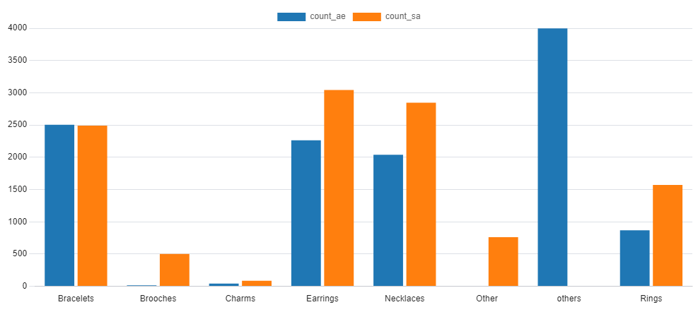

Word Analysis:
Lets seprate each distinct word from our merged table and store it in a temporary table for further analysis.
```sql
-- Create the temporary table
CREATE TEMPORARY TABLE temp_word AS
SELECT
    DISTINCT UNNEST(STRING_TO_ARRAY(LOWER(title), ' ')) AS word,
    rating
FROM products_merged;
```

Check for words with solid ratings and their count.  
```sql
-- Show words with average high rating and highest word occurrence
SELECT
    word,
    COUNT(*) AS word_count,
    AVG(rating::numeric) AS average_rating
FROM
    temp_word
WHERE
    LENGTH(word) >= 3
GROUP BY
    word
HAVING
    AVG(rating::numeric) >= 4.5
ORDER BY
    word_count DESC
LIMIT 20;
```
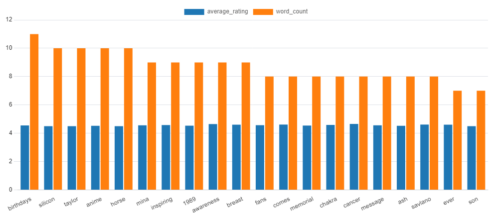

Lets get a count of relevant word and the number of time its mentioned in the data set. for this we will remove words with less than three characters. 
```sql
-- Get the most occurring words
SELECT
    COUNT(*) AS word_count,
    word
FROM (
    SELECT
        UNNEST(STRING_TO_ARRAY(LOWER(title), ' ')) AS word
    FROM
        products_merged
) AS subquery
WHERE
    LENGTH(word) > 3
GROUP BY
    word
HAVING
    COUNT(*) >= 100
ORDER BY
    word_count DESC;

```
| Word Count | Word      |
|------------|-----------|
| 14838      | women     |
| 8526       | earrings  |
| 7432       | with      |
| 7231       | necklace  |
| 6915       | silver    |
| 6804       | gold      |
| 6669       | jewelry   |
| 6340       | bracelet  |
| 4538       | girls     |
| 4454       | from      |
| 4163       | sterling  |
| 3426       | ring      |
| 3186       | beads     |
| 3164       | plated    |
| 3055       | crystal   |
| 2763       | gift      |
| 2471       | bracelets |
| 2407       | stone     |
| 2359       | gifts     |
| 2298       | chain     |

Lets look at the distribution of materials in both the region. 
```sql
-- Check material distribution
SELECT
    word,
    COUNT(word) AS word_count
FROM
    temp_word
WHERE
    word IN ('bronze', 'gold', 'silver', 'copper', 'titanium','alloy','zinc')
GROUP BY
    word
ORDER BY
    word_count DESC;
```
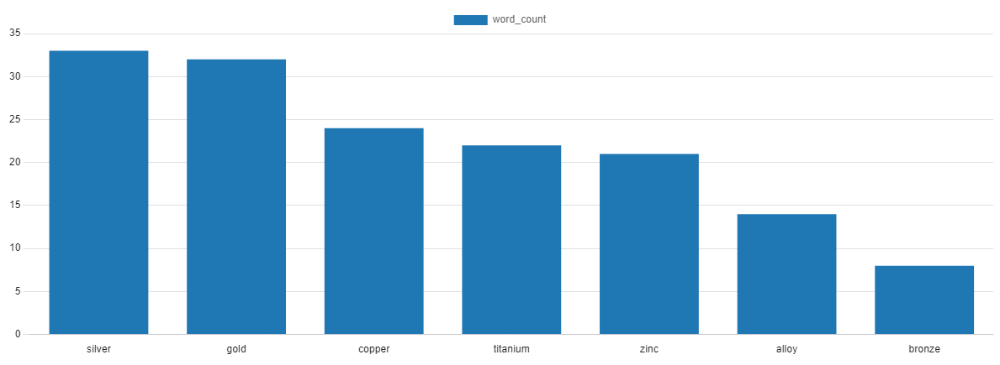

Lets See the number of jewelry listings between men and women
```sql
-- Check gender segment
SELECT
    word,
    COUNT(word) AS word_count
FROM
    temp_word
WHERE
    word IN ('men', 'women')
GROUP BY
    word
ORDER BY
    word_count DESC;
```
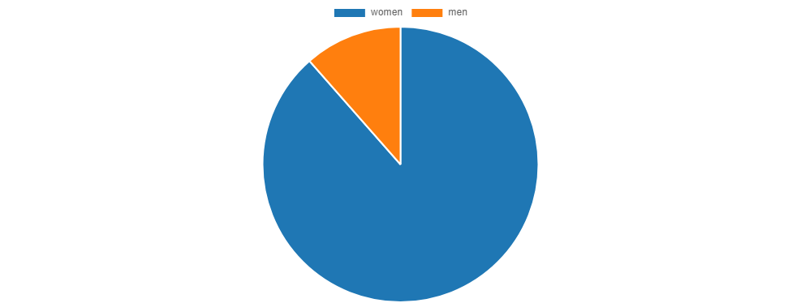

Lets see the total jewelry catgeory distribution in our merged data. 
```sql
-- Check category distribution
SELECT
    word,
    COUNT(word) AS word_count
FROM
    temp_words
WHERE
    word IN ('ring', 'bracelet', 'necklace', 'brooch', 'earrings', 'charm')
GROUP BY
    word
ORDER BY
    word_count DESC;
```
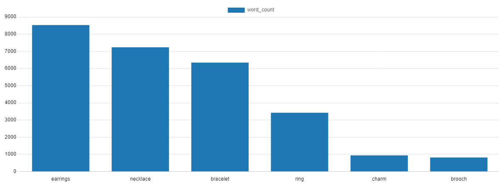 

Look for brand dominance in our listing data. 
Brand Analysis:
```sql
-- Check brand summary
SELECT
    brand,
    ROUND(AVG(rating), 1),
    SUM(reviews),
    COUNT(brand),
    ROUND(AVG(price), 1)
FROM
    products
WHERE
    brand <> 'Generic'
GROUP BY
    brand
ORDER BY
    COUNT DESC;

-- Fetch distinct brands with reviews, listings, average rating, and average price
SELECT
    DISTINCT brand,
    SUM(reviews) AS reviews,
    COUNT(brand) AS listings,
    ROUND(AVG(rating), 1) AS avg_rating,
    ROUND(AVG(price), 1) AS avg_price
FROM
    products
WHERE
    brand <> 'Generic'
GROUP BY
    brand
ORDER BY
    reviews DESC,
    avg_price
LIMIT 10;
```
| Brand                  | Average Rating | Total Reviews | Brand Count | Average Price |
|------------------------|-----------------|---------------|-------------|---------------|
| GENERIC                | 4.4             | 155,796       | 1,126       | 143.1        |
| PANDORA                | 4.5             | 264,843       | 561         | 298.7        |
| ZAVERI PEARLS          | 3.9             | 89,548        | 356         | 48.7         |
| RIBAI                  | 4.2             | 1,950         | 354         | 88.4         |
| SWAROVSKI              | 4.6             | 147,282       | 314         | 548.8        |
| YOUBELLA               | 3.9             | 202,468       | 250         | 41.0         |
| OTHER                  | 3.7             | 2,024         | 229         | 62.6         |
| SHINING DIVA FASHION   | 3.8             | 119,834       | 228         | 59.4         |
| YELLOW CHIMES          | 3.9             | 84,869        | 212         | 34.4         |
| GUESS                  | 4.2             | 12,662        | 203         | 169.3        |

Lets compare the brand performances across our regions. 
```sql
-- Compare brand presence across the two markets
SELECT
    brand,
    SUM(CASE WHEN source = 'ae' THEN count ELSE 0 END) AS COUNTAE,
    SUM(CASE WHEN source = 'sa' THEN count ELSE 0 END) AS COUNTSA
FROM (
         SELECT
             brand,
             COUNT(*) AS count,
             'ae' AS source
         FROM products_uae
         GROUP BY brand

         UNION ALL

         SELECT
             brand,
             COUNT(*) AS count,
             'sa' AS source
         FROM products
         GROUP BY brand
     ) AS subquery

GROUP BY
    brand

HAVING
    SUM(CASE WHEN source = 'ae' THEN count ELSE 0 END) >= 10
    AND SUM(CASE WHEN source = 'sa' THEN count ELSE 0 END) >= 10

ORDER BY
    COUNTSA DESC;
```
| Brand                  | CountAE | CountSA |
|------------------------|---------|---------|
| GENERIC                | 265     | 861     |
| PANDORA                | 297     | 264     |
| SWAROVSKI              | 115     | 199     |
| YOUBELLA               | 99      | 151     |
| OTHER                  | 113     | 116     |
| SHINING DIVA FASHION   | 168     | 60      |
| MICHAEL KORS           | 39      | 33      |
| SOIMISS                | 11      | 32      |
| LEE COOPER             | 21      | 31      |
| ESTELE                 | 29      | 27      |
| OLIVIA BURTON          | 19      | 25      |
| ORITI                  | 18      | 21      |
| AZONEE                 | 40      | 21      |
| REBUY                  | 11      | 19      |
| JUST CAVALLI           | 20      | 17      |
| TERRIFI                | 48      | 16      |
| SWEET ROSE             | 73      | 15      |
| CTEW                   | 28      | 12      |

This would be the end of our sql journey so far eveyrthing looks good and our data is aslo cleaned and processed now we can move to our last stage of the ETL processes which is loading. 

## 3) Load: Generate visuals and insights with Tableau & python

### Visuals with Tableau:
Developed a comprehensive dashboard designed for tracking top listings, with a specific focus on their ratings, reviews, and prices. This tool offers a user-friendly interface that provides a clear overview of key metrics associated with leading products and their respective listings. The dashboard is equipped with intuitive interactive features, ensuring easy navigation and understanding of the performance of top-rated products. Additionally, the system allows for the seamless integration of more listing data to display the latest top listings, complete with their categories, country of origin, and availability.
[Link to Dashboard](https://public.tableau.com/views/Jewelrey_listing/Dashboard32?:language=en-US&:display_count=n&:origin=viz_share_link) 

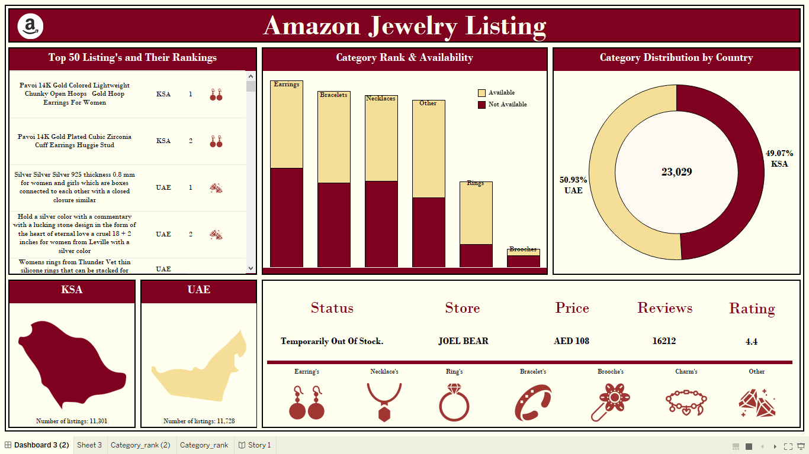


### Top Listings Overview:
1) Display essential metrics (rating, reviews, price) for the highest-ranked products.
2) Enable quick assessment of the competitive landscape within the dataset.

### Category Breakdown:
1) Provide a detailed breakdown of listings based on categories.
2) Highlight the ranking distribution within each category.

### Country Analysis:
1) Incorporate a breakdown of listings by the countries of origin.
2) Allow users to discover patterns and preferences specific to different regions.


### Sentiment analysis with chatgpt
I fed the list of the top most frequently occurring words from both Amazon KSA and UAE datasets into ChatGPT. The goal was to obtain a basic overview of similarities and differences between the two countries bellow are chatgpt's findings:

#### UAE Preferences:
- The presence of terms like "Pandora" and "Swarovski" suggests a potential sentiment of sophistication and luxury.
- Keywords like "elegant" and "modern" imply a preference for contemporary and stylish designs.

#### KSA Preferences:
- The inclusion of "classic" and "boho" indicates a potential sentiment for timeless and bohemian styles.
- Shared brand preferences like "Pandora," "Swarovski," and "Zirconia" may indicate a sentiment of trust and popularity.

#### Shared Preferences:
- Common terms like "gold," "silver," "rose," and "white" suggest a shared sentiment for traditional and versatile jewelry.
- Keywords like "wedding" and "anniversary" imply sentiments associated with special occasions and celebrations.

#### Overall Sentiment:
- Both regions share commonalities in material choices, and color preferences, suggesting a positive sentiment towards these elements in both markets.
- The use of terms like "elegant," "modern," "classic," and "boho" indicates a diverse range of preferences, suggesting a positive sentiment towards a variety of styles.

### Breaking down the list of words into further categories:
With the help of GPT, I was able to categorize the list of most occurring words. The extracted categories are as follows:

1-Attributes

2-Gemstones

3-Animal-themed

4-Color

5-Material/Texture

6-Occasion/Event

7-Style/Design

After getting these categories, I further processed and refined my words data onto these categories via excel after that I hopped over to Python to generate a bunch of colorful bar graphs, as these words had some interesting findings and stories to tell.

### Visuals with Python libraries matplo & numpy:
```python
import matplotlib.pyplot as plt
import numpy as np

data = {
    'Animal-themed': {'cat': 259, 'butterfly': 613, 'angel': 115, 'snake': 403},
    'Gemstones': {'diamond': 968, 'emerald': 299, 'sapphire': 293, 'ruby': 133, 'quartz': 527, 'turquoise': 298},
    'Material/Texture': {'acrylic': 186, 'enamel': 443, 'leather': 367, 'beaded': 480, 'braided': 152, 'woven': 104, 'embroidered': 111, 'resin': 109},
    'Style/Design': {'bohemian': 288, 'boho': 520, 'classic': 312, 'modern': 598, 'vintage': 396, 'gothic': 161, 'ethnic': 144, 'retro': 168, 'punk': 144, 'traditional': 379, 'minimalist': 156},
    'Occasion/Event': {'wedding': 1438, 'bridal': 375, 'bridesmaid': 122, 'anniversary': 415, 'birthday': 972, 'graduation': 146, 'prom': 144, 'party': 468, 'Valentine': 380, 'Halloween': 181},
    'Symbols': {'heart': 1772, 'star': 532, 'moon': 520, 'sun': 129, 'infinity': 161, 'clover': 135, 'tree': 253, 'crown': 233, 'flower': 803},
    'Attributes': {'adjustable': 1340, 'lightweight': 307, 'hypoallergenic': 455, 'magnetic': 406, 'personalized': 197, 'engraved': 122, 'statement': 425, 'stackable': 242, 'stretch': 192},
    'Color': {'black': 1184, 'blue': 947, 'red': 616, 'green': 728, 'pink': 939, 'purple': 213, 'rainbow': 137, 'white': 1391, 'yellow': 1000, 'turquoise': 298},
}

for category, values in data.items():
    plt.figure(figsize=(10, 6))

    colors = plt.cm.viridis(np.linspace(0, 1, len(values)))

    bars = plt.bar(values.keys(), values.values(), color=colors)
    plt.title(f'Bar Graph for {category}')
    plt.xlabel('Items')
    plt.ylabel('Count')
    plt.xticks(rotation=45, ha='right')

    plt.legend([bars], [category], loc='upper right')

    plt.tight_layout()

    plt.show()
```
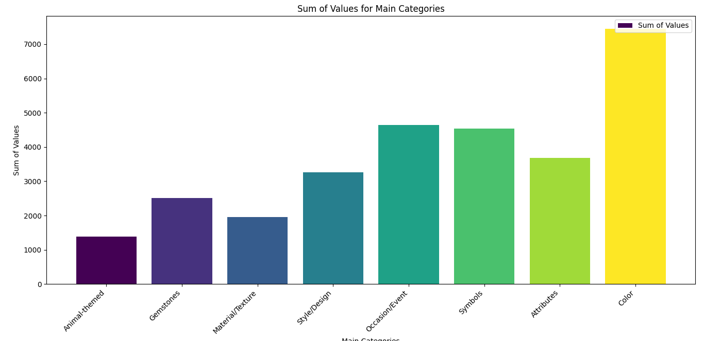 
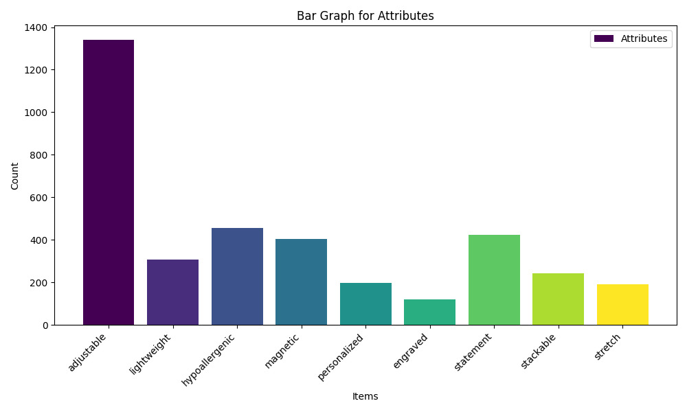
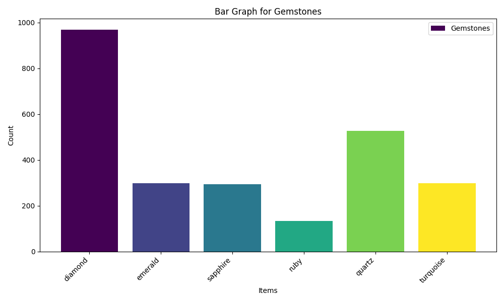 
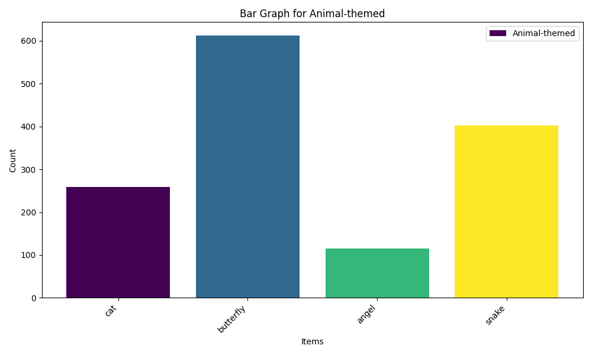
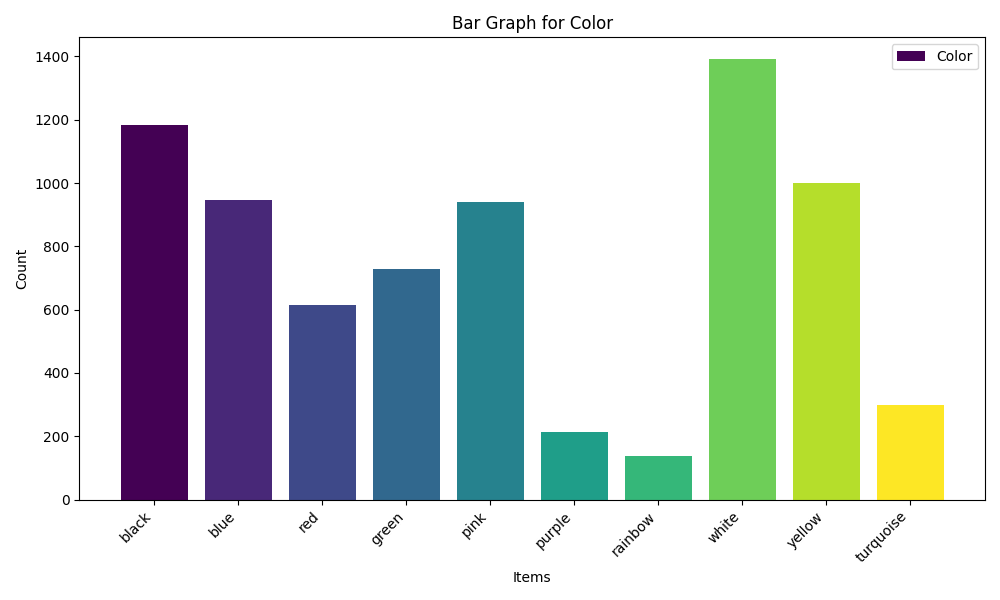 
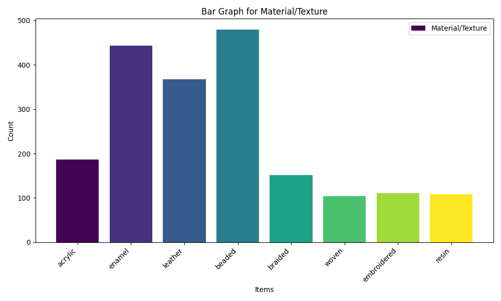
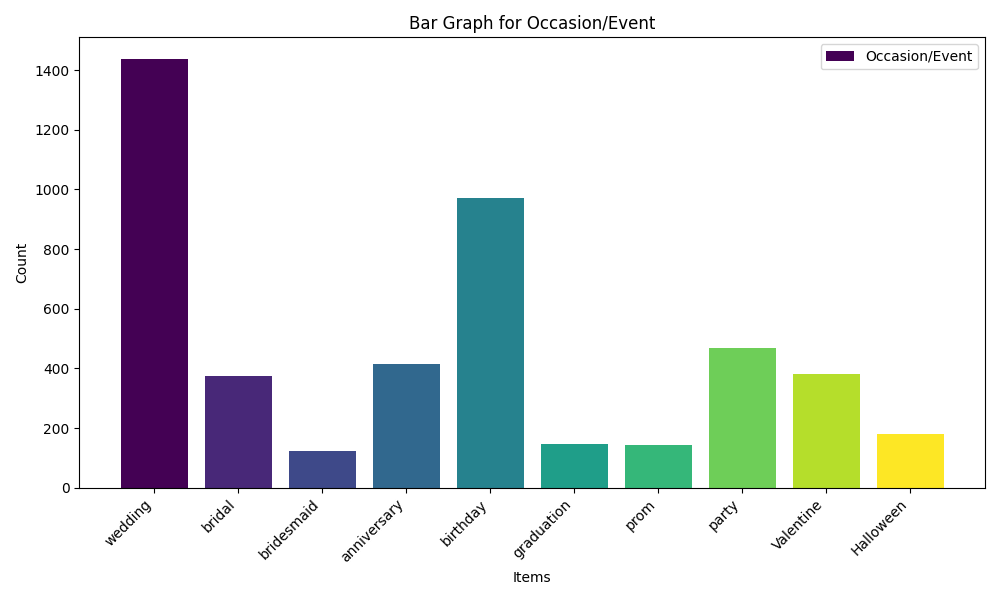 
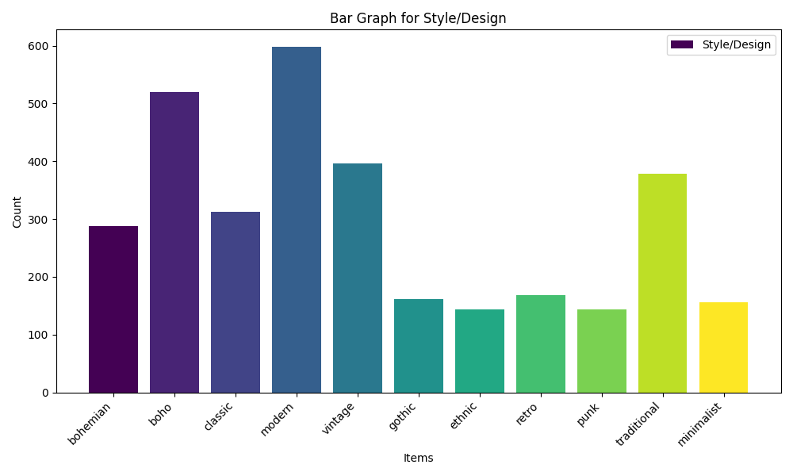
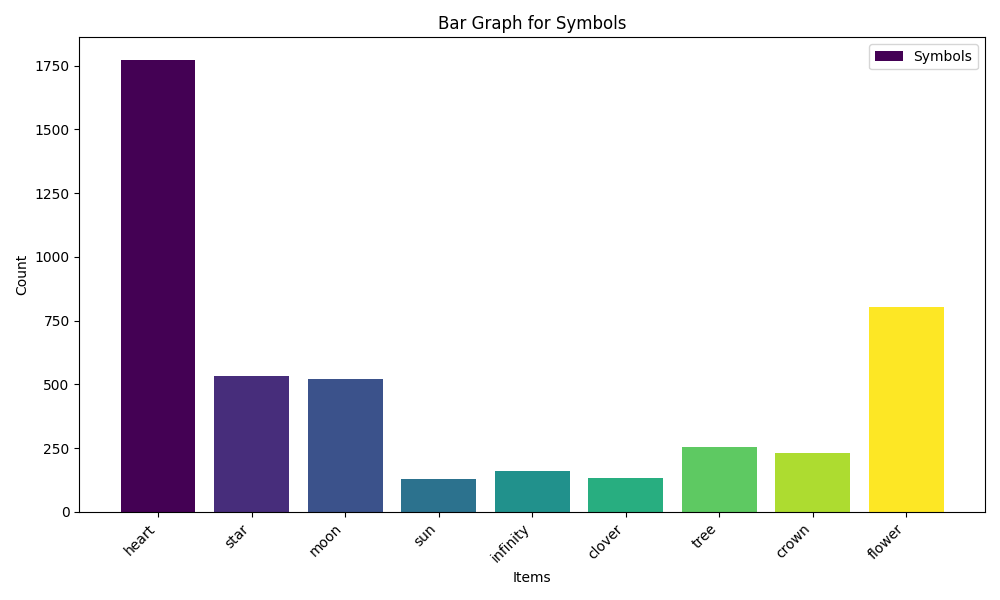


#### Key findings:

- **Category Significance:** The first graph showcases the categories/attributes that are given the highest importance in the Amazon market. The subsequent graphs break down the words within each category, highlighting their significance and relevance.
- **Most Occurred Theme:** The most occurred theme is the "Heart" symbol with 1772 occurrences.

- **Popular Gemstone:** "Diamond" is the most popular gemstone mentioned with 968 occurrences.

- **Common Material/Texture:** "Beaded" and "Enamel" are relatively common materials used in jewelry, with 480 and 443 occurrences respectively.

- **Preferred Style/Design:** "Bohemian" and "Modern" are popular styles with 288 and 598 occurrences respectively.

- **Frequent Occasion/Event:** "Wedding" is the most mentioned occasion with 1438 occurrences.

- **Dominant Color:** "White" and "Black" are dominant colors with 1391 and 1184 occurrences respectively.

- **Attributes:** "Adjustable" is a common attribute mentioned with 1340 occurrences.

The top three categories were color, occasions and then symbols meaing that sellers on amazon heavily focus on these three jewelry attributes, The least focused attribute is animal theme and that can be a niche we can explore and target when basing on what sort of jewelry product to sell. I asked chatgpt if it can suggest a product idea targeting a specific niceh from out above categroies this is the idea it gave me for a product:

#### Adaptive Charm Bracelets
##### Modular Design
- **Modular Design:** The base bracelet should have a modular design, allowing easy attachment and detachment of charms. This ensures a user-friendly experience for customization.
- **Adjustable Size:** Include an adjustable mechanism to fit various wrist sizes comfortably.
- **High-Quality Materials:** Craft the base bracelet from durable and hypoallergenic materials to ensure long-lasting wear.

##### Interchangeable Charms
- **Secure Attachment:** Design charms with a secure and easy-to-use attachment mechanism to prevent accidental detachment.
- **Diverse Materials:** Create charms using various materials like enamel, acrylic, leather, and metals to cater to different aesthetic preferences.
- **Personalization:** Incorporate options for customers to personalize certain charms, such as engraving initials or significant dates.

##### Mood-Sensing Technology
- **Subtle Changes:** Implement mood-sensing technology that subtly alters the color or texture of the bracelet. The changes should be noticeable but not overpowering.
- **User Calibration:** Provide a calibration feature in the mobile app, allowing users to adjust the sensitivity of the mood-sensing technology based on their individual preferences.

##### Theme Collections
- **Thematic Design:** Each theme collection should have a cohesive design with charms that complement each other. For example, the "Celestial Collection" could include charms inspired by stars, moons, and galaxies.
- **Limited Edition Packaging:** Enhance the exclusivity of theme collections with special packaging, possibly including a brief description of the inspiration behind the collection.

##### I then asked Gpt why it picked the product idea and what was the reason for it. 

- **Personalized Jewelry:** The data highlights a strong preference for personalized jewelry, especially items that can be adjusted for a perfect fit.

- **Crucial Events:** Events like weddings and birthdays are identified as crucial, indicating potential opportunities for themed jewelry.

- **Interest in Themes:** There is a notable interest in themes such as animals, gemstones, symbols, and occasions/events.

##### Concept Overview.

Our concept revolves around allowing users to easily switch out charms based on their mood or preferences, incorporating the identified themes and catering to the significance of events.

- **Material Preferences:** People have different material preferences, including acrylic, enamel, and leather. Our adaptive charm bracelets will utilize a mix of these materials to attract a broad audience.

- **Fashion-Tech Integration:** Adding technology such as mood-sensing and smart features aligns with the modern trend of blending fashion with tech, appealing to those who value both style and functionality.

- **Limited Edition Charm Sets:** Addressing the interest in exclusivity, we propose limited edition charm sets. Collaborating with artists or influencers for these sets adds uniqueness and excitement for customers.

- **Market Focus:** Tailoring this idea specifically for the KSA and UAE market involves considering cultural preferences and the popularity of personalized accessories in these regions.

Based on the ideas and design details provided by ChatGPT, I then generated an AI image following the prompt given by ChatGPT. Here is what our product idea should look like.
Adaptive Charm Bracelets

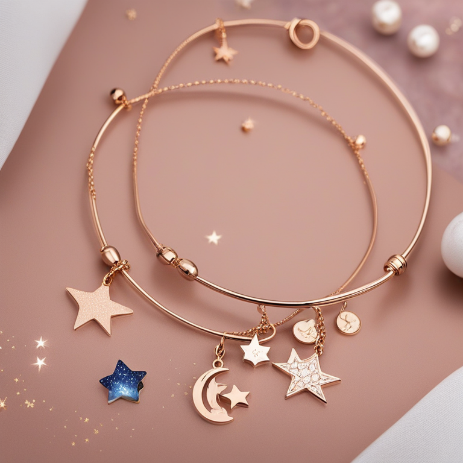 


## Recommendations: 

### Product Design Strategy

To create a distinctive product in the competitive market, it can be very beneficial to design features & ideas recommended by Ai and combine Ai generated ideas with human ideas.

#### Instagram Influencer Collaboration

**Approach:**
Reach out to influential personalities on Instagram, specifically those with a strong personal brand.

**Partnership:**
Collaborate with influencers to design individualistic charms that align with their brand image.

**Customization:**
Craft charms that are not only aesthetically appealing but also prominently feature the celebrity/influencer's brand elements.

**Marketing:**
By allowing influencers to sell these exclusive charms as part of their own branding, we create a unique selling proposition.

#### Combining Key Features

- **Versatility:**
  Leverage the versatility of bracelets, making them suitable for a wide range of occasions and preferences.

- **Customization:**
  Implement customizable elements, such as adjustable features and personalized charms, aligning with market preferences.

- **Tech Integration:**
  Integrate innovative features like mood-sensing technology, providing a modern and interactive dimension to the product.

- **Limited Edition Concept:**
  Embrace the concept of limited edition charm sets, fostering a sense of exclusivity and anticipation among customers.

## Conclusion

The use of ChatGPT and AI models, combined with a human touch, can provide solid and unique product designs and ideas for launching and competing in the market. There are unlimited ideas, inspirations, and designs to explore. In a sense, we are combining artistic and statistical elements to give us the best possible designs to choose from, which I find pretty neat and believe can greatly assist individual sellers.

For anyone looking to start selling on Amazon, they can use the above scraper to gather data in any category they prefer. They can then combine that data with AI models to generate useful insights and ideas on how to stand out from the crowd on Amazon.

As time progresses, more and more tasks are being automated. While there is a significant number of people with a negative outlook towards AI and valid concerns, this project aims to showcase the positive side of how AI can assist us in various tasks and enhance productivity.

This project also highlights the invaluable nature of data analysis. I was able to gather all the above insights using only five variables: title, price, rating, reviews, and price. As this was my first web scraping project, I did not collect a larger dataset; regardless, I hope this project showcases to new aspiring data analysts and those considering entering data analytics how intriguing the field can be. There are still many unexplored areas in the data mentioned above that I haven't ventured into yet.


## Analytics Approach

### 1. Data Extraction and Web Scraping
Utilizing Python for web scraping, the project extracts valuable information from Amazon's jewelry product listings. A curated list of URLs is processed to gather data on titles, prices, ratings, reviews, availability, and brand information.

### 2. Data Transformation with SQL and Excel
Post data extraction, the collected raw data undergoes transformation using a combination of SQL and Excel. SQL scripts are employed to clean and structure the data, addressing any inconsistencies or missing values. Excel is then used for additional refinement and formatting.

### 3. Analysis and Visualization using Tableau
With the transformed dataset, Tableau is employed for in-depth analysis and visualization. Key performance indicators, trends, and patterns in the jewelry market are visually represented, offering a comprehensive understanding of the data.

### 4. Sentiment Analysis and Idea Generation with ChatGPT
To add a unique dimension, ChatGPT is leveraged for sentiment analysis, idea generation, and summarization. The AI model assists in extracting insights from customer reviews, understanding market sentiments, and generating innovative product ideas.

### 5. Conclusion and Decision-Making
The insights derived from the analytics process serve as a foundation for decision-making. The combination of statistical analyses, AI-generated ideas, and human interpretation results in a well-rounded understanding of the market, enabling informed decisions for product development and market entry strategies.

This analytics approach ensures a thorough examination of the data, incorporating both quantitative and qualitative aspects, and leveraging advanced technologies for a holistic understanding of the jewelry market on Amazon.

